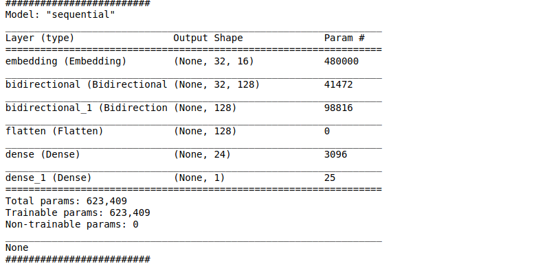
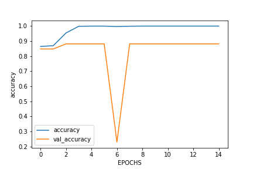
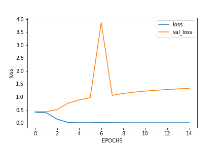

# Spam-detection
In this task we have to classify the mails into spam and not spam categories.

# Dataset 
So I found the dataset for this task on Kaggle you can download the dataset [here](https://www.kaggle.com/team-ai/spam-text-message-classification).
The dataset is '.csv' file with all the mails of two categories (spam and not spam(ham)), I considered that spam = 1 and not spam/ham = 0. In the dataset there are around 5572 samples of dataset. Now I trained the model on 4572 examples and validated it over the remaining 1000 samples.

# Model
This is an NLP(Natural Language processing task). The model that I made is a sequence model with LSTM cells:

Now if you look at the code I have used two layers of Bidirectional LSTM's. The parameters learned are Flattened using the Flatten layer from keras API and is given as an input to a fully connected neural network:

This is the model Architecture:

# Training and Testing 
The model was build using the Tensorflow framework. I trained the model for 15 EPOCHS. And each epoch took around 4 seconds to complete. I trained the model many times until I got the best model. The Spam Model directory contains of the saved model. Refer to tensorflow docs to see how to save and load a pretrained model (https://www.tensorflow.org/guide/keras/save_and_serialize). For this saved model i got a Training accuray of 1.000(100%) and Validation accuray of 0.8820(88.2%). 

# Graphs
The accuracy Graph:

 

As you can see the validation accuracy dropped to around 23% during the 6th EPOCH. Which I think was not good, but still it increased through the later epochs.

The Loss Graph:

As you can see the training loss smoothly decreases and the validation loss shoots up but then decreases again which is fine. I don't know why did that sudden increase took place, but I guess it's fine.

# Testing on custom message 

Now I tested on my custom messge "Get 100% off for this random thing that you won in a lottery!!!!!".
Now this message surely is a spam and it predicts spam as well

# Learn more:
I have written an [article](https://levelup.gitconnected.com/build-a-mail-spam-classifier-using-tensorflow-and-keras-9bc687d2a1d3) on medium explaining the steps to build this classifier do give it a read
